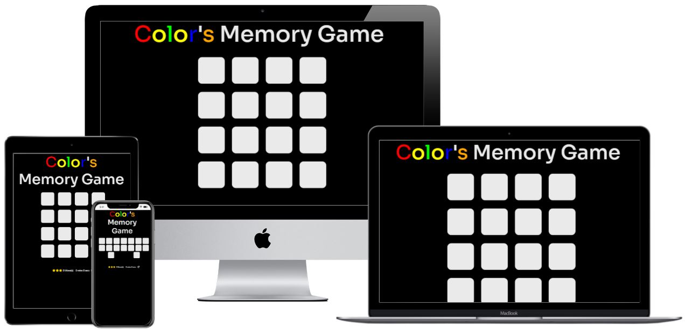
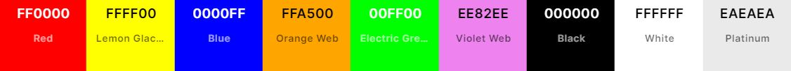

<h1 align="center">Milestone Project 2 - Color's Memory Game</h1>

[Click here to view the live project :link:](https://matsim91.github.io/Milestone-Project-2-Memory-Game/)

Color's Memory Game was created for kids from age 3-6 years but even adults can enjoy playing! Memory games help building thinking skills, improving the concentration, improving the memory, attention, and persistence. The benefits are wide, especially as everyone needs to have the brain constantly stimulated by learning new things so this is a great experience for kids while they can have fun playing.

# Table Of Contents

1. [User Experience (UX)](#user-experience)
    - [User stories](#user-stories)
    - [Design](#design)
    - [Wireframes](#wireframes)
2. [Features](#features)
3. [Technologies Used](#technologies-used)
4.  [Languages Used](#languages-used)
5.  [Frameworks, Libraries & Programs Used](#frameworks-libraries-and-programs-used)
6.  [Testing](#testing)
    - [Testing User Stories](#testing-user-stories)
    - [Additional Testing](#additional-testing)
    - [Bugs and Fixes](#bugs-and-fixes)
7. [Deployment](#deployment)
8. [Credits](#credits)
    - [Code](#code)
    - [Content](#content)
    - [Media](#media)
    - [Acknowledgements](#acknowledgements)

# User Experience

This game was created with the main intent to develop quick thinking skills, improve concentration, focus and develop the memory! The brain is a powerful machine that always needs fuel and action. Keep the brain active by playing memory games!

-   ## User stories

    -   ### First Time Visitor Goals
        1. As a First Time user, I want to easily understand the main purpose of the site and learn more about the game.
        2. As a First Time user, I want to be able to easily navigate throughout the site to understand and play the game.
        3. As a First Time user, I want to learn exactly how the game works by checking the instructions.

    -   ### Returning and Frequent Visitor Goals
        1. As a Returning user, I want to get keep playing the game and practicing to getter better scores.
        2. As a Returning user, I want to finish the game with a better time.
        3. As a Returning user, I want to to complete the game beating all my previous records.

-   ## Design
    -   ### Colour Scheme
	- I wanted to give a high color contrast to the project. So I have chosen to use all the three primary colors (red, yellow, and blue) all the three secondary colors (orange, green, and violet) and also white and black.

        - The main colors used are Red (#FF0000), Yellow (#FFFF00), Blue (#0000FF), Orange (#FFA500), Green (#00FF00), Violet (#EE82EE), Black (#000000), White (#FFFFFF), and Gray (#EAEAEA).

        

    -   ### Typography

        - The font choose for the H1 headers was the Sora font.

        - The font was imported from [Google Fonts](https://fonts.google.com/)

*   ## Wireframes

    - The wireframe was developed using [balsamiq](https://balsamiq.com/).

    - The wireframe was created thinking about making the game layout simple and clean and also when the player is viewing the screen to not have the screen with too many unnecessary buttons and actions.

    - Landing Page wireframe (index.html) Wireframe - [View](https://github.com/MatSim91/Milestone-Project-2-Memory-Game/blob/master/project/Landing-page-wireframe.JPG) - The landing page wireframe changed a bit as a suggestion from my mentor Akshat. The Play Game button got bigger to give more focus to the main feature and also I have moved to stay on top of the Instructions button.

    - Game page Wireframe (game.html) - [View](https://github.com/MatSim91/Milestone-Project-2-Memory-Game/blob/master/project/Memory-game-wireframe.JPG) - There was not much change from the start of the project wireframe on the game.html page. The focus here was basically keep the screen clean from unnecessary text, buttons and features so the player can focus on the game and on the important game stats.

    - Possible future update to the project: Add a Theme feature with two buttons where the player can choose weather to use the "Dark Theme" or the "Light Theme".

# Features

- Interactive Modal pop-up on index.html page - With instructions and play game options. 

- Memory game counter actions - It counts the actions everytime the user flips two cards, it adds one move to the counter. If the user can finish the game with lesser actions the better.

- Memory game timer - The timer starts as soon as the user interacts and opens the first two cards.

- Interactive Modal pop-up on game.html page - When game is finished the pop up appears with the game stats and with the "Play again" button.

- Trophies score rating - Based on the number of actions that were performed by player. If actions are less than ten the player gets three trophies. If actions are between eleven and fifteen player gets two trophies. Anything above sixteen actions player gets one star.

- Restart button - Players can restart the game and the game stats at any time by clicking on the restart icon. 

- Dark Theme/Light Theme button toggler - Players can choose their desired theme by simply clicking on the button and toggling between the Dark Theme and Light Theme. The dark theme is set by default.

- Music player - Added a music player playing game music. Added three icons from fontawesome to: pause, stop and play the game music.

# Technologies Used

A brief overview of the languages, frameworks, and other tools I've used on this project:

- [HTML5](https://en.wikipedia.org/wiki/HTML5)
    - Semantic markup language as the shell of the site.

- [CSS3](https://en.wikipedia.org/wiki/Cascading_Style_Sheets)
    - Cascading Style Sheets as the design of the site.

- [Bootstrap](https://getbootstrap.com/docs/4.0/layout/grid/)
    - Loaded Bootstrap to provide all its pre-built classes, grid and font functions.

- [JavaScript](https://www.javascript.com)
   - Used to add interactive, for modal pop-up and for the memory game to run properly.

# Languages Used

-   [HTML5](https://en.wikipedia.org/wiki/HTML5)
-   [CSS3](https://en.wikipedia.org/wiki/Cascading_Style_Sheets)
-   [JavaScript](https://pt.wikipedia.org/wiki/JavaScript)

# Frameworks Libraries and Programs Used

1. [Bootstrap:](https://getbootstrap.com/docs/4.5/getting-started/introduction/)
    - Bootstrap was used to assist with the responsiveness and styling of the website.

2. [JavaScript Validator](https://jshint.com)
    - Used to check and validate all JavaScript code to check for any typos or errors.

3. [Google Fonts:](https://fonts.google.com/)
    - Google fonts was used to import the 

4. [Git](https://git-scm.com/)
    - Git was used for version control by utilizing the Gitpod terminal to commit to Git and Push to GitHub.

5. [GitHub:](https://github.com/)
    - GitHub was used to store the projects code after being pushed from Git.

6. [Balsamiq:](https://balsamiq.com/)
    - Balsamiq was used to create the [Wireframes](#wireframes) during the design process.

7. [Google Chrome DevTools](https://developers.google.com/web/tools/chrome-devtools)
    - Used for testing and fixing website bugs. Also used Google Lighthouse for performance testing.

8. [Font Awesome:](https://fontawesome.com/)
    - Font Awesome was used on the game.html page to add the trophies icon, the square icon and the restart icon.

# Testing

- All the links, modal pop-ups and features  were tested thoroughly.

- The website was tested in Google Chrome, Microsoft Edge, Mozilla Firefox, both on Windows and Mac OS.

- Through the Console device toolbar it was also tested using the following emulated devices: Moto G4, Galaxy S5, Pixel 2, iPhone 5/SE iPhone 6/7/8, iPhone X, iPad, iPad Pro, Surface Duo.

- Used [Am I Responsive](http://ami.responsivedesign.is/#) for testing different viewports and a [Mockup Generator](http://techsini.com/multi-mockup/index.php) to create the image being used on the top of this readme.

- The W3C Markup Validator and W3C CSS Validator Services were used to validate every page of the project to ensure there were no syntax errors in the project:

    -   [W3C Markup Validator](https://jigsaw.w3.org/css-validator/#validate_by_input) - I have validated using Direct Input from each HTML page and by URL.

    -   [W3C CSS Validator](https://jigsaw.w3.org/css-validator/#validate_by_input) - I have validated CSS using Direct Input and by URL. No errors appeared on the output.

    - [Web Formatter](https://webformatter.com/) - Was also used for checking for any errors in HTML and CSS.

    - [JavaScript Validator](https://jshint.com) - Used for checking for JavaScript errors.

    - [Google Lighthouse](https://developers.google.com/web/tools/lighthouse#devtools) - Was used to check overall page performance
        - 

## Testing User Stories

-   ### First Time Visitor Goals
    1. As a first time user entering the site the game title already shows it is a memory game and there is already a "Instructions" button for the user to click and learn more about the game.
    2. As a first time user the site is easy to navigate with the buttons being responsive and the "Instructions" and "Play Game" button are straight forward in telling me what to expect for my click action.
    3. As a first time user wanting to know exactly how the game works I click on the "Instructions" option to read the rules

-   ### Returning and Frequent Visitor Goals
    1. As a return user that keeps playing a lot I can keep resetting my score stats to try to get better scores.
    2. As a return user I can keep checking the game timer on the game stats bar to try and finish the game with a better time.
    3. As a return user I can keep checking my actions and time to give me a clear view how my score is compared with my previous stats, I can also use the 3 trophies rating as an easier way to compare my previous score.

## Additional Testing

-   ### Testing page index.html:
    1. Checking the index.html page I have tested the Modal pop-up interactivity by opening and closing several times on different browsers and different screen resolutions.
    
    2. When clicking on the "Instructions" button it should open a Modal pop-up with the instructions and two other buttons. 
        2.1 Inside the Instructions Pop-up I have checked also the "Close" and "Play game" buttons to make sure they were working properly. 
    
    3. Tested "Play game" button to make sure it is redirecting to the game.html page.

-   ### Testing page game.html:
    1. Checked if the cards when clicked would flip over and stay open until you select a second card.
        1.1 Tested the unmatch option when the second selected card is from a different color the cards should flip back to the original state.
        1.2 Tested the match option when the second selected card is from the same color then the cards should stay opened until the game ends.

    2. Tested the restart feature when the game has not started (when no card was clicked) just to make sure it would not change the page appeareance. Also tested the restart feature when just one card is flipped and when two cards are flipped and matched.

    3. Tested the clock to make sure it would only start when the second card is clicked and make sure the clock would reset when the restart icon is clicked. Also tested if the correct time is displayed in the Modal pop-up when the player finished the game:
        - "in **X**mins **X**secs"

    4. Tested the actions counter feature to make sure it is counting properly when every two cards are selected. Also the actions counter must reset after we hit the restart icon. Tested that the seconds and minutes were displaying and counting properly. Checked the Modal pop-up when the game finished to make sure the correct amount of actions is appearing there:
        - "You have made **X** actions"

    5. Tested the trophies feature to make sure it was giving the correct amount of trophies based on the correct amount of actions:
        - If actions are less than 10 player gets 3 trophies.
        - If actions are higher than 10 AND less then 15 player gets 2 trophies.
        - Anything above 16 actions player gets 1 trophie.
    Also checked if the starts were showing properly in the Modal pop-up that appears when the game finishes:
        - "Your Rating is: **X**"

    6. Tested the Modal pop-up that appears when the game finishes and all the cards colors had a match. The pop-up should appear showing the correct ending game stats and offering the option to the player to play the game again or to close the pop-up.

    7. Tested the Dark Theme/Light Theme button toggler - Clicked on the toggler several times and with different stages of the game (before no card was opened, with some equal cards flipped over and while clicking on the restart game button). Tested the theme button toggler with the finish game pop up to make sure players can also interact with the toggler while the modal pop up is being displayed on the scren.

    8. Tested the media player feature to make sure all buttons were working as expected. Tested the buttons while the finish game pop up shows when player finishes the game to make sure he could control the music player even with the modal popup opened. Tested the buttons with the theme changed and with the restart button.

## Bugs and Fixes

1. While creating the Modal pop-up in the index.html page the modal was not appearing on the browser. 
	- 1.1 **Fix:** After closer look it was because bootstrap was interfering with the classes modal-container, modal_container and modal. I have updated these classes name and it fixed the bug.

2. While trying to load the Font Awesome Icon there was an error and the Icon was not appearing. I was using a CDN as a source to load the Icon.
    - 2.1 **Fix:** I was able to fix this by creating an account with Font Awesome and adding the script source references that they have reccomended.

3. While running the JavaScript code through a validator it showed that a few semicolons were missing and a few typos.
    - 3.1 **Fix:** Added semicolons to the missing lines and fixed the typos.

4. While trying to run the game it was not running properly.
    - 4.1 **Fix:** While checking why I the game source on the game.html page was incorrect. After I updated it fixed the problem.

5. The restart button was not working.
    - 5.1: **Fix:** Typo with the onclick that was calling the runGame function.

6. The project was not passing through the HTML validator and it was returning the error:  "The type attribute on the li element is obsolete".
    - 6.1 **Fix:** I have updated the list from an ul (unordered list) to an ol (ordered list) and have inserted unique values to each card color (values from 1 to 8) I have also updated the JavaScript code to check if the values match.

7. After adding a few togglers regarding the theme switch on JavaScript the classes were not changing at all.
    7.1 **Fix** Some classes were having a higher priority due to having a more specific target on style.css page. I have changed these classes to be more general and not affect the class list toggler.

# Deployment

- **GitHub Pages:** Under the repository page: 
    1. Click on Settings 
    2. Scroll down to the "GitHub Pages" section 
    3. Select the Source Branch 
    4. Click Save.

- For this project, I have used the cloud-based IDE [Gitpod](https://gitpod.io/) and [GitHub](http://github.com/) as a free git repository hosting.

    1. I started the project by creating a new Repository on GitHub and loading the [Code Institute Gitpod Template](https://github.com/Code-Institute-Org/gitpod-full-template).

    2. Installed the [Gitpod extension](https://chrome.google.com/webstore/detail/gitpod-dev-environments-i/dodmmooeoklaejobgleioelladacbeki) and on my GitHub repo I clicked on the Gitpod button to create a new Master Workspace on GitPod.

    3. After creating the workspace I developed the website using Gitpod and pushing my commits to GitHub using the following commands:
        - `git add "file-name"` - To add a file for staging.
        - `git commit -m "description-of-update"` - To commit.
        - `git push` - To push my commits to GitHub
        - I have also used extra git commands such as: 
        - `python3 -m http.server` - To run a preview of the website on the browser.
        - `git status` - To display the current state of the working directory and the staging area.

## Running locally

1. Go tho this [project repository](https://github.com/MatSim91/Milestone-Project-1-One-Porcent) in GitHub while signed in in your own GitHub account.
2. Click on the dropdown menu Code option.
3. Click on "Open with GitHub Desktop" to clone and open the repository locally.
4. Click on the "Choose" option and navigate to the local path where you want the cloned repository to be.
5. Click "Clone"

- [Click here](https://docs.github.com/en/free-pro-team@latest/desktop/contributing-and-collaborating-using-github-desktop/adding-and-cloning-repositories) for more cloning GitHub options.

# Credits

- Vertical alignment with help from Stack Overflow: [Link Here](https://stackoverflow.com/questions/47334164/how-to-middle-align-the-content-of-the-div-with-height-100vh/47334256)

- The Modal pop-up was created with the help from Florin Pop: [Link Here](https://www.youtube.com/watch?v=XH5OW46yO8I)

- The Memory game was inspired by Sandra Israel memory game and was heavily customized and optimized: [Link Here](https://scotch.io/tutorials/how-to-build-a-memory-matching-game-in-javascript#toc-4-star-rating)

- The Card flip Animation inspired by Tutorials Point: [Link Here](https://www.tutorialspoint.com/css/css_animation_flip.htm)

- [Code Institute Course](https://codeinstitute.net/) for the great idea of developing a memory game.

- [Bootstrap](https://getbootstrap.com) for the large and free libraries.

- [Font Awesome](https://fontawesome.com/icons) for the huge collection of free icons they offer.

- [Web Formatter](https://webformatter.com/) Used for formatting HTML, CSS and Javascript and also to check for errors.

- [Google Fonts:](https://fonts.google.com/) Thanks to Google for providing this huge amount of free fonts on the site.

- [ZAPSLAT](https://www.zapsplat.com/sound-effect-category/game-music-and-loops/) My many thanks to ZAPSLAT for providing the great music and for having such a large music catalog at hand.

## Code

- [Bootstrap4](https://getbootstrap.com/docs/4.5/getting-started/introduction/) - Bootstrap Library used throughout the project to make it easier using the grid system and pre-maded classes.

- [Modal pop-up](https://www.youtube.com/watch?v=XH5OW46yO8I) was inspired by the tutorial.

- The [Memory Game](https://scotch.io/tutorials/how-to-build-a-memory-matching-game-in-javascript#toc-4-star-rating) was inspired by Sandra Israel tutorial.

- [Vertical Alignment](https://stackoverflow.com/questions/47334164/how-to-middle-align-the-content-of-the-div-with-height-100vh/47334256) this Stack Overflow post helped with the vertical alignment.

- [Card flip animation](https://www.tutorialspoint.com/css/css_animation_flip.htm) was created with the the Tutorial Point code.

## Content

-  No external content was used for this project.

## Media

-   The game music was downloaded from [ZAPSLAT](https://www.zapsplat.com/sound-effect-category/game-music-and-loops/)

## Acknowledgements

-   My mentor Akshat for all his help and ideas.

-   Thanks to the Code Institute Tutor Support for helping adding me more hours on GitPod so fast!

-   Slack community peers for helping with general questions.